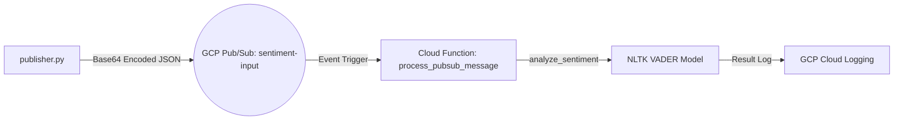
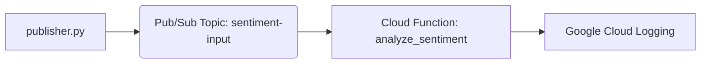

```markdown
# Real-time Sentiment Analysis Inference Pipeline on GCP

## Project Overview
This project implements a scalable, real-time sentiment analysis inference pipeline leveraging **Google Cloud Platform (GCP)**. The system follows an event-driven architecture where text data is streamed through **Google Cloud Pub/Sub** and processed by a serverless **Google Cloud Function** using the NLTK VADER model for sentiment analysis.

## Architecture Diagram


The architecture ensures high scalability and reliability by decoupling the data producer from the inference consumer.

## Setup and Authentication

1. **Initialize GCP Project**:
```bash
gcloud auth login
gcloud config set project trans-trees-485006-b5

```


2. **Enable Required APIs**:
```bash
gcloud services enable pubsub.googleapis.com \
cloudfunctions.googleapis.com \
cloudbuild.googleapis.com \
logging.googleapis.com

```


3. **Create Pub/Sub Resources**:
```bash
gcloud pubsub topics create sentiment-input

```


## Deployment

Deploy the sentiment analysis function to GCP:

```bash
gcloud functions deploy sentiment-analyzer-function \
--runtime python39 \
--trigger-topic sentiment-input \
--entry-point process_pubsub_message \
--memory 256MB \
--region us-central1 \
--set-env-vars GCP_PROJECT_ID=trans-trees-485006-b5

```

## Usage Instructions

1. **Install Dependencies**:
`pip install -r publisher_requirements.txt`
2. **Run the Publisher**:
```bash
# Set environment variables
export GCP_PROJECT_ID="trans-trees-485006-b5"
export PUB_SUB_TOPIC_ID="sentiment-input"

# Execute publisher
python publisher.py

```


3. **Monitor Results**:
View real-time inference results in **GCP Logs Explorer**.

## Testing

The core logic is verified using Python's `unittest` framework to ensure high code coverage.

```bash
python -m unittest discover tests

```

```

```

